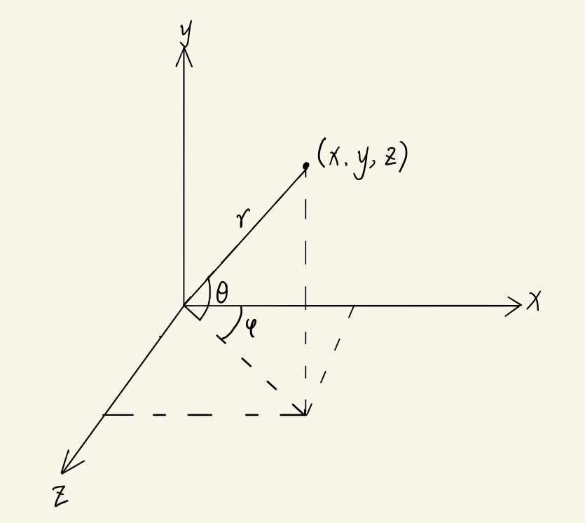

# Ray Tracing The Next Week 学习笔记

## Motion Blur

> The basic idea is to generate rays at random times while the shutter is open and intersect the model at that one time. 

运动模糊，生活中很常见，就是物体在快门打开到关闭的短暂时间间隔内发生移动。相机发送射线，射线捕捉物体在随机快门时间间隔内线性插值的位移后的位置，多次射线采样达到运动模糊效果。

## Perlin Noise

**Perlin Noise**（柏林噪声）指由Ken Perlin发明的自然噪声生成算法 。

柏林噪声的特点：

- 同样的输入可以得到相同的输出，可复现性。
- 输入相邻的点可以获得相近的数字。
- 简单快捷，多用作hack。

### 平滑插值

原文使用**三线性插值（trilinear interpolation）**做平滑插值，然后用**埃尔米特平滑处理（Hermitian Smoothing）**再做平滑优化。

因为效果上看上去还是显得有点块状的噪点，所以另外采用了空间中一点的随机方向向量表示**梯度（gradient）**，即梯度向量。

在产生噪声纹理方面，我们通常用多个相加频率的复合噪声，被称为**Turbulence**。

### 参考资料

- [Simplex noise demystified](http://staffwww.itn.liu.se/~stegu/simplexnoise/simplexnoise.pdf)对Simplex noise进行详细的介绍——取自wiki
- [https://zh.wikipedia.org/wiki/Perlin%E5%99%AA%E5%A3%B0](https://zh.wikipedia.org/wiki/Perlin噪声)wiki上对Perlin噪声的介绍

## Image Texture Mapping

**Image Texture Mapping（图像纹理映射）**

之前都是用撞击点p处的位置信息进行程序化纹理生成，现在要用到一张纹理图片采用2D(u,v)来映射到物体上。

使用经过缩放(u,v)的图片的一个直接的方法是将u和v四舍五入到整数，用作(i,j)点的像素。这显然很拙劣，纹理和物体的尺寸大多数不一致，如果我们修改了图片的分辨率，那么代码就不得不重新修改。所以正确的做法应该采用纹理坐标，而不是图像像素坐标。意思大概就是物体对应所在位置比例的像素应该映射纹理坐标对应比例的纹理。重点在比例上。

例如：像素坐标(i,j)在一个N~x~×N~y~的图片中对应的图像纹理坐标(u,v)应该为：

$$
\begin{align*}
u=\frac{i}{N_{x}-1}
\end{align*}
$$

$$
\begin{align*}
v=\frac{j}{N_{y}-1}
\end{align*}
$$

所以需要在撞击点处收集uv信息。

在球坐标上，uv表示为：
$$
u = \frac{\phi}{2\pi}(\phi\in[0,2π])
$$

$$
v = \frac{\theta}{\pi}(\theta\in[0,π])
$$

则u∈[0,1]，v∈[0,1]，此步骤为规格化。

在球坐标上，可以用θ和φ表示(x,y,z)，θ∈[0,π]，φ∈[0,2π]，设r=1，则

$$
x =  \cos(\theta)\cos(\phi)
$$
$$
z =\cos(\theta) \sin(\phi)
$$
$$
y=\sin{\theta}
$$

则
$$
\phi = \arctan{\frac{z}{x}}
$$

$$
\theta = \arcsin{y}
$$

此时，φ∈[-π,π]，θ∈[-π/2,π/2]。因此计算uv的时候需要将其规格化，使u,v∈[0,1]。

此外需要注意的是纹理坐标和图像坐标上关于v的映射，

在texture coordinates上v映射到image coordinates应该为：
$$
v_{i}=1-clamp(v_{t},0.0,1.0)
$$
.jpg)

## Rectangles and Lights

### Emissive Materials

发光材质

### Rectangle

矩形面片

## Instances

